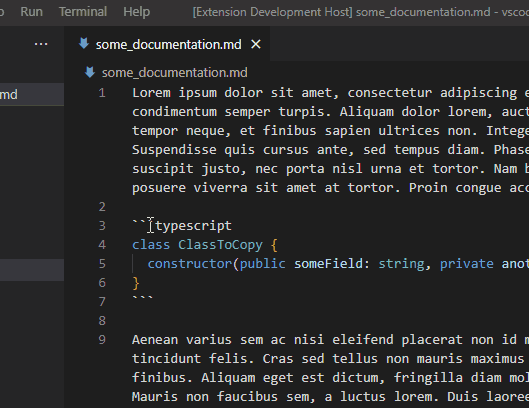

# vscode-pastinator

A **WIP** productivity plugin for vscode that creates a new file when you paste code on the file explorer.

Let's be honest, we all copy and paste code from stackoverflow. So let's do it the fastest way possible!

Inspired by IntelliJ. It has this feature and it evens read the class name to automaticly name the file.

This is my first extension so if you have issues, please create an issue on Github!

## How to use

Simply copy some code from anywhere. In this example, in some documentation.
In vscode, simply select a file or folder in the explorer and you can either:

1. CTRL+V
1. Use the context menu

Then, enter the wanted filename for this file. And there it is! Your copied file all ready in a single file.

### Subfolder creation

If you want to put the file in `/some_folder/nested_folder/` but `nested_folder` does not exists, you can enter `nested_folder/new_file.ext` and the extension will create that folder for you.

## Compatibility

This extension does not analyse any code, so this should work with any language.

## Extension Settings

There are no settings for now. If you have ideas, let me know with an issue!

## Planned features

- A new setting to let users define a regex to search in the copied code a filename to use
- Unit/Integration tests

## Known Issues

None for now. Please let me know if you encounter some!

## Release Notes

### 0.0.1

First release, this is my first vscode extension so I can't say this is stable.

### 0.0.2

Some fixed and additions to the Readme

### 0.0.3

Resolved issue #001 (CTRL+V)
